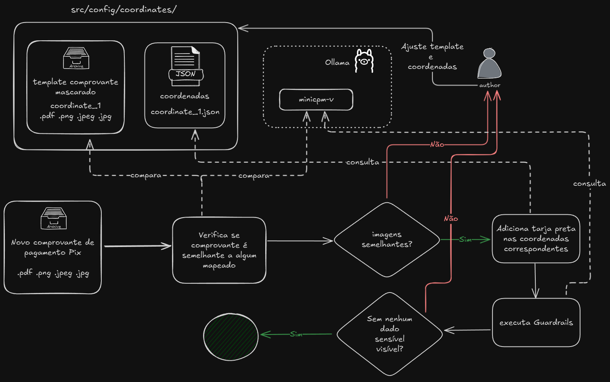

# **llm-liaa-payment-receipt**

<p align="center"> 🚀 This script is designed to count, organize and masking sensitive data from payment receipts of Pix</p>

⭐ Our Goal is 500 payment-receipts from 20 different institutions

The workflow for receiving a new payment receipt is described in the image below.



<h3>🏁 Table of Contents</h3>

<br>

===================

<!--ts-->

💻 [Dependencies and Environment](#dependenciesandenvironment)

🔑 [Dataset](#dataset)

☕ [Using](#using)

👷 [Author](#author)

<!--te-->

===================

<div id="dependenciesandenvironment"></div>

## 💻 **Dependencies and Environment**

You will need [install Ollama](https://ollama.com/):

Models `qwen2.5vl:7b` in `sensitive_data_masker.py` and `qwen2.5vl:7b` in ``guardrails.py`

```
# sensitive_data_masker.py
$ ollama run qwen2.5vl:7b

#guardrails.py
$ ollama run qwen2.5vl:7b
```

This model yielded good results, but feel free to test others.

Or you can use **Gemini** instead deepseek models, you **NEED to use the PAID Google Gemini API to not share sensitive informations**. If you choose to use Gemini, [configure a valid Gemini API Key](https://aistudio.google.com/apikey) and ensure you have a `.env` file with the environment variable **GEMINI_API_KEY**.

To setup environment use (you will need [venv](https://docs.python.org/pt-br/3.13/library/venv.html)):

```
$ make setup
```

And enable the virtual ambient using:

```
$ source .venv/bin/activate
```

You can clean the environment using

```
$ make clean
```

<div id="dataset"></div>

## 🔑 **Dataset**

Attention! Take one backup before execute any test

### Specified for author

You save dataset in google drive and link folder in repository to then

First of all install Google Drive desktop

Create a folder in Linux to mount the corresponding Google Drive folder in Windows (created only once, change "h" if needed).

```cmd
sudo mkdir -p /mnt/h
```

Mount in WSL2 using (change "h" if needed):

```cmd
sudo mount -t drvfs H: /mnt/h
```

And link dataset in Google Drive to a folder in WSL2, in root folder use:

```cmd
ln -s "/mnt/h/Meu Drive/dataset/" .
```

### Others users

You will need a dataset folder in root folder like _/dataset/dataset/_. You can get the content in [put link of the dataset in Kaggle]()

The format is:

```
dataset/
└── Glener/
    └── nu/
        └── receipt_1.png
└── João/
    └── xp/
        └── receipt_1.png
        └── receipt_2.pdf
```

<div id="using"></div>

## ☕ **Using**

First, check the [dependencies](#dependenciesandenvironment) process

To check utility scripts, verify [scripts/README.md](/scripts/README.md)

All use cases can be called individually and have debugging configured.

This script masks sensitive data in payment receipts (or adapt it to your scenario.) using coordinate templates.

To exec for one specified file:

```
$ python main.py -i 'example.jpeg' -n '99pay'
```

To exec to all files in one directory:

```
$ python main.py -i 'dataset'
```

Ensure the folder structure is:

```
dataset/
└── Glener/
    └── nu/
        └── receipt_1.png
└── João/
    └── xp/
        └── receipt_1.png
        └── receipt_2.pdf
```

Example output structure (same as input):

```
├── Glener/
│   └── nu/
│       └── receipt_1.png (masked)
├── João/
    └── xp/
        └── receipt_1.png (masked)
        └── receipt_2.pdf (masked)
```

<div id="author"></div>

#### **👷 Author**

Made by Glener Pizzolato! 🙋

[](https://www.linkedin.com/in/glener-pizzolato-6319821b0/)
[](mailto:glenerpizzolato@gmail.com)
