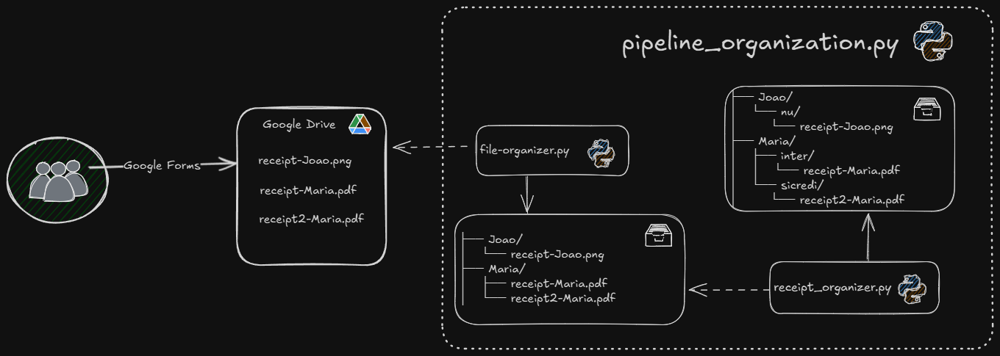

# Organization Readme

Check dependencies and environment in [README.md](./README.md)

This Readme explains some utility codes and how the files are organized in the format below.

```
├── Joao/
│   └── nu/
│       └── receipt-Joao.png
├── Maria/
│   ├── inter/
│   │   └── receipt-Maria.pdf
│   └── sicredi/
│       └── receipt2-Maria.pdf
```

### 🐍 **Util - receipt_organizer.py**

Use this script to enter a folder, read all the receipts, and use Gemini to identify which bank each receipt is from, moving the files to a categorized output

TODO: Use ollama instead Gemini.

Ensure your input folder structure is as follows:

```
├── Joao/
│   └── receipt-Joao.png
├── Maria/
│   ├── receipt-Maria.pdf
│   └── receipt2-Maria.pdf
```

To exec:

```
$ python receipt_organizer.py -i "INPUT_FOLDER_PATH" -o "OUTPUT_FOLDER_PATH"
```

Example output structure:

```
├── Joao/
│   └── nu/
│       └── receipt-Joao.png
├── Maria/
│   ├── inter/
│   │   └── receipt-Maria.pdf
│   └── sicredi/
│       └── receipt2-Maria.pdf
```

### 🌀 **Pipeline - pipeline_organization.py**

This file is for organizing the receipts by name and then classifying them according to which bank they belong to.

To understand how the pipeline works, take a look in the image:



Behind the scenes, we execute the scripts `file_organizer.py` and `receipt_organizer.py`.

You exec using:

```
python pipeline_organization.py -i 'INPUT_FOLDER_PATH' -o 'OUTPUT_FOLDER_PATH'
```
