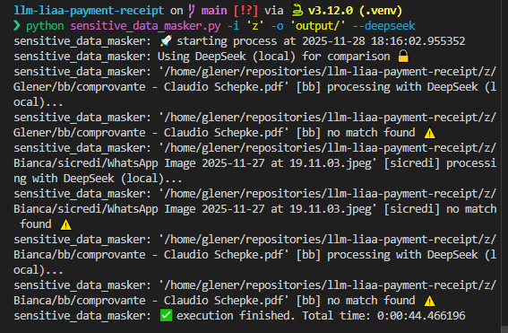

# qwen3-v1:8b

Nunca dava match mesmo tendo coordenada



# gemma3:12b

Match errado

# gemma3:4b

match errado

# minicpm-v

Alterado temperatura do default (Qual?) para 0.0

Trocando prompt de:

```
<PERSONA>
Você é um especialista em análise de documentos bancários.
</PERSONA>

<MISSION>
Analise as duas imagens fornecidas e determine se elas têm o MESMO FORMATO/LAYOUT de comprovante bancário.

ATENÇÃO! IMPORTANTE!

- Por mais que os comprovantes são do mesmo banco, eles podem ter dados diferentes, keys para mais, por exemplo um mostrar o "CPF" e outro não. Nesse caso você deve retornar is_match=false, pois os elementos visíveis não são os mesmos.
- A primeira imagem (referência) pode ter dados mascarados com tarjas pretas - IGNORE essas tarjas, foque na disposição dos elementos
- Compare apenas a ESTRUTURA, LAYOUT e FORMATO do documento, Os VALORES dos dados podem ser diferentes - isso é NORMAL.
- Foque na localização de cada elemento, as keys de cada campo devem estar no mesmo local. Por exemplo se a key "nome" de uma imagem está no canto superior esquerdo, a outra imagem também deve ter a key "nome" no canto superior esquerdo.
- Ambas imagens deve ter os mesmos elementos (keys) visíveis nas mesmas localizações/coordenadas, mesmo que os valores estejam diferentes ou mascarados.

Retorne APENAS um JSON válido (sem markdown, sem explicações extras) com:
{{
    "is_match": true/false,
    "confidence": 0.0-1.0,
    "reason": "explicação detalhada"
}}

Seja rigoroso: apenas retorne is_match=true se tiver alta confiança (>85%).
</MISSION>
```

Para:

````
<PERSONA>
Você é um auditor rigoroso de layouts bancários.
</PERSONA>

<MISSION>
Seu objetivo é comparar a ESTRUTURA visual de dois comprovantes.
Ignore os valores (dinheiro, datas, nomes). Foque apenas nos RÓTULOS (KEYS) dos campos e suas posições.

Siga estes passos estritamente:
1. Liste os 3 primeiros rótulos (campos) visíveis no topo da Imagem 1.
2. Liste os 3 primeiros rótulos (campos) visíveis no topo da Imagem 2.
3. Verifique se a Imagem 1 possui algum campo que NÃO existe na Imagem 2 (ex: uma tem "CPF" e a outra não).
4. Compare a posição visual: Os campos estão alinhados da mesma forma?

<REGRAS>
- Tarjas pretas na imagem 1 são censuras. Ignore o conteúdo, mas verifique se o campo ainda existe.
- Se os rótulos não forem IDÊNTICOS, não é o mesmo layout.
</REGRAS>

Após sua análise passo-a-passo, forneça o JSON final:
```json
{
    "reason": "Resumo da sua análise aqui...",
    "is_match": true/false,
    "confidence": 0.0-1.0
}
````
